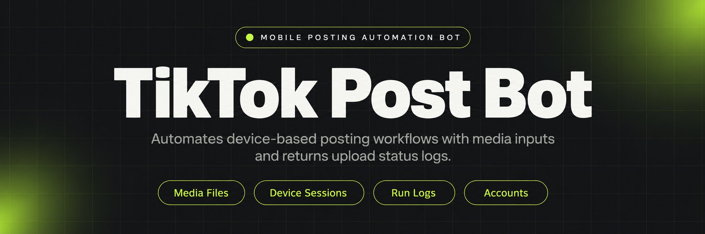
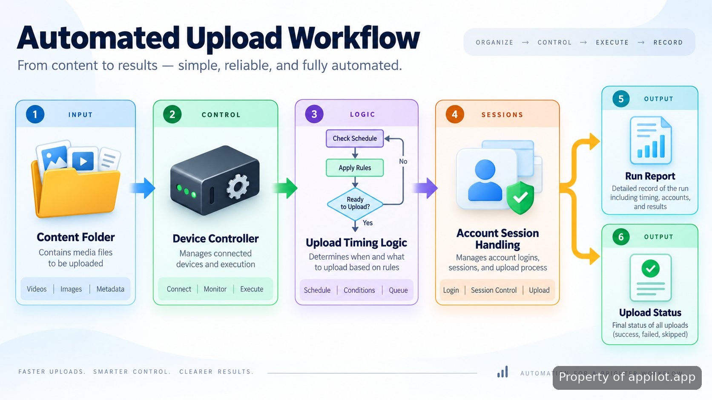

<p align="center">
  <a href="https://www.appilot.app/store/tiktok-posting-bot-scheduling" target="_blank" rel="nofollow">
    
  </a>
</p>

## TikTok Auto Post Bot

TikTok Auto Post Bot is a reference repository showing how a mobile posting workflow can be structured around physical Android and iOS devices. The project demonstrates device control, upload sequencing, timing logic, and account separation patterns without pretending to be a complete ready-to-run platform. It is designed for developers evaluating how real device automation works when browser scripts and emulator-only approaches are not suitable.

> A reference implementation for understanding mobile posting automation patterns.

The repository focuses on the mechanics behind a controlled posting pipeline: preparing media, connecting to a device, performing upload actions, and collecting run results. It does not claim to bypass platform rules. TikTok's terms restrict certain forms of automated activity, so this project should be reviewed against current platform policies before any deployment.

<a href="https://www.appilot.app/store/tiktok-posting-bot-scheduling" target="_blank" rel="nofollow">
  
</a>

<p align="center">
  <a href="https://t.me/Bitbash333" target="_blank" rel="nofollow">
    
  </a>&nbsp;
  <a href="https://wa.me/923249868488?text=Hi%2C%20I%27m%20interested." target="_blank" rel="nofollow">
    
  </a>&nbsp;
  <a href="mailto:hello@appilot.app" target="_blank" rel="nofollow">
    
  </a>&nbsp;
  <a href="https://www.appilot.app" target="_blank" rel="nofollow">
    
  </a>
</p>

## Real device automation workflow

Mobile automation changes when the target environment is an actual phone. Instead of depending on emulator behavior, the workflow uses device connections, screen interaction layers, and execution logs that represent how a physical device run is tracked. The main challenge removed is the gap between a test environment and the hardware where the application actually operates.



A typical run begins with prepared media files, captions, and account configuration. The controller selects the target device session, follows the upload sequence, and writes execution information. A sample run may record a media file name, selected account identifier, device connection state, and completion result so failures can be inspected instead of guessed.

## Core Features

| Feature | Description |
| --- | --- |
| Physical Device Control | The problem of emulator differences is reduced by structuring runs around connected Android and iOS hardware with tracked device sessions. |
| Upload Sequence Handling | The problem of inconsistent manual posting steps is addressed through ordered actions for media selection, upload flow, and completion tracking. |
| Timing Behavior Layer | The problem of identical repeated actions is reduced by allowing configurable delays and scheduling patterns inside the demonstration workflow. |
| Account Session Separation | The problem of mixing account states is handled through isolated configuration records for different posting identities. |
| Proxy Handling Reference | The problem of separating network routing concepts is documented through configuration patterns rather than automatic provider management. |

## Multi account management patterns

Managing more than one account requires clear boundaries between sessions, credentials, and device assignments. The repository demonstrates this conceptually by separating configuration data from execution logic. A practical setup keeps account records independent so a failed run on one profile does not obscure the state of another.

The workflow treats each account as a separate execution context. A configuration entry can define the selected device, media source, and session reference used during a run. This structure makes debugging easier because the generated logs point back to a specific execution path rather than a shared collection of actions.

## Technical stack and implementation notes

The repository uses a service-style structure built around Python automation components, device communication layers, configuration files, and local logging. Python is used because it provides a practical environment for coordinating files, processes, and automation libraries. Device interaction follows platform-supported development concepts documented by Android developers and Apple developer resources.

The project references Android debugging workflows through the official Android documentation: <a href="https://developer.android.com/tools/adb" target="_blank" rel="nofollow">Android Debug Bridge documentation</a>. iOS development concepts are covered through <a href="https://developer.apple.com/documentation/" target="_blank" rel="nofollow">Apple developer documentation</a>. Mobile application behavior should always be tested within the rules and technical limits of the platform being automated.

```text
mobile-posting-reference/
├── src/
│   ├── controller.py
│   ├── device_manager.py
│   ├── upload_flow.py
│   └── session_store.py
├── config/
│   ├── devices.json
│   └── accounts.json
├── media/
│   └── queue/
├── logs/
│   └── runs.log
├── requirements.txt
└── README.md
```

```bash
git clone repository-url
cd mobile-posting-reference
pip install -r requirements.txt
python src/controller.py
```

<a href="https://tally.so/r/yP5oDx?platform=GitHub&amp;format=Product+repo&amp;brand=Appilot&amp;niche=appilot&amp;page=TikTok+Auto+Post+Bot+for+Android+Devices&amp;date=2026-09-07" target="_blank" rel="nofollow">
  
</a>

## TikTok Auto Post Bot setup and usage

**STEP 1 — Download & Set Up the Project**
Download, set up, and install **TikTok Auto Post Bot** to get the project running from the repository files.

**STEP 2 — Connect Device**
Open the controller interface and connect an available phone session through the configured device manager.

**STEP 3 — Configure Upload**
Select account settings, media files, timing values, and device parameters from the configuration files.

**STEP 4 — Run Upload Flow**
Trigger the upload command and review generated logs containing device state, actions, and run results.

## Android automation and iOS automation considerations

Android automation and iOS automation require different handling because the operating systems expose different testing and interaction models. Android workflows commonly rely on debugging interfaces, while iOS workflows require Apple-approved development approaches. The repository keeps these differences visible instead of hiding them behind a single abstraction.

For device interaction references, the implementation follows concepts available in <a href="https://developer.android.com/training/testing" target="_blank" rel="nofollow">Android testing documentation</a> and <a href="https://developer.apple.com/documentation/xcode" target="_blank" rel="nofollow">Xcode testing documentation</a>. The goal is understanding architecture: input preparation, device communication, action execution, and result capture.

## Detection awareness and policy boundaries

Automated posting systems can create platform compliance concerns. This repository documents human-like timing concepts as workflow design ideas, not as a guarantee against detection or enforcement. Platform rules change, and any deployment should be reviewed against the current TikTok terms and developer guidance.

The project is a technical reference rather than a complete production service. A maintained automation system requires ongoing updates, operational controls, device management, and policy review as platforms evolve. Developers can use this repository to understand the moving parts before deciding how a larger implementation should be structured.

## Use Cases

- Automation researchers can study how physical phones, configuration files, and execution logs fit together in a mobile workflow.
- Content operations teams can evaluate how separated account sessions and media queues could be organized before building internal systems.
- Developers can prototype device-based posting flows and compare hardware execution with emulator-based testing approaches.

## Proxy handling and network configuration

Network routing is another area where automation projects need clear boundaries. The repository presents proxy handling as a configuration concept, showing where network settings could be represented in a larger system. It does not include a managed proxy service or promise a specific network outcome.

Separating network configuration from upload logic keeps the workflow easier to inspect. When a run fails, developers can identify whether the issue relates to device state, account configuration, media preparation, or connection settings instead of reviewing one combined process.

## Operational references

The repository approach follows general automation engineering practices: keep logs, separate configuration, document external dependencies, and test against the environment where execution happens. Additional references include <a href="https://owasp.org/www-project-automated-threats-to-web-applications/" target="_blank" rel="nofollow">OWASP automation security guidance</a> and <a href="https://docs.python.org/3/library/logging.html" target="_blank" rel="nofollow">Python logging documentation</a>.

## FAQ

### Does this automation run on real phones instead of emulators?

Yes. The repository demonstrates workflows built around physical Android and iOS devices rather than emulator-only execution. It focuses on device sessions, action sequencing, and logging patterns.

### Can this repository be used for production posting?

The repository is a reference implementation showing architectural patterns, not a complete maintained production system. Production deployments require additional operational controls, updates, and policy review.

### How are multiple accounts handled in the workflow?

Multiple accounts are represented through separated configuration records and execution contexts. This keeps device assignments, session information, and run logs easier to manage.

<table>
  <tr>
    <td align="center" width="33%">
      
      <p>This scraper helped me gather thousands of posts effortlessly. The setup was fast, and exports are super clean and well-structured.</p>
      <p><b>Nathan Pennington</b><br>Marketer<br>★★★★★</p>
    </td>
    <td align="center" width="33%">
      
      <p>What impressed me most was how accurate the extracted data is. Likes, comments, timestamps — everything aligns perfectly.</p>
      <p><b>Greg Jeffries</b><br>SEO Affiliate Expert<br>★★★★★</p>
    </td>
    <td align="center" width="33%">
      
      <p>It's by far the best tool I've used. Ideal for trend tracking, competitor monitoring, and influencer insights.</p>
      <p><b>Karan</b><br>Digital Strategist<br>★★★★★</p>
    </td>
  </tr>
</table>